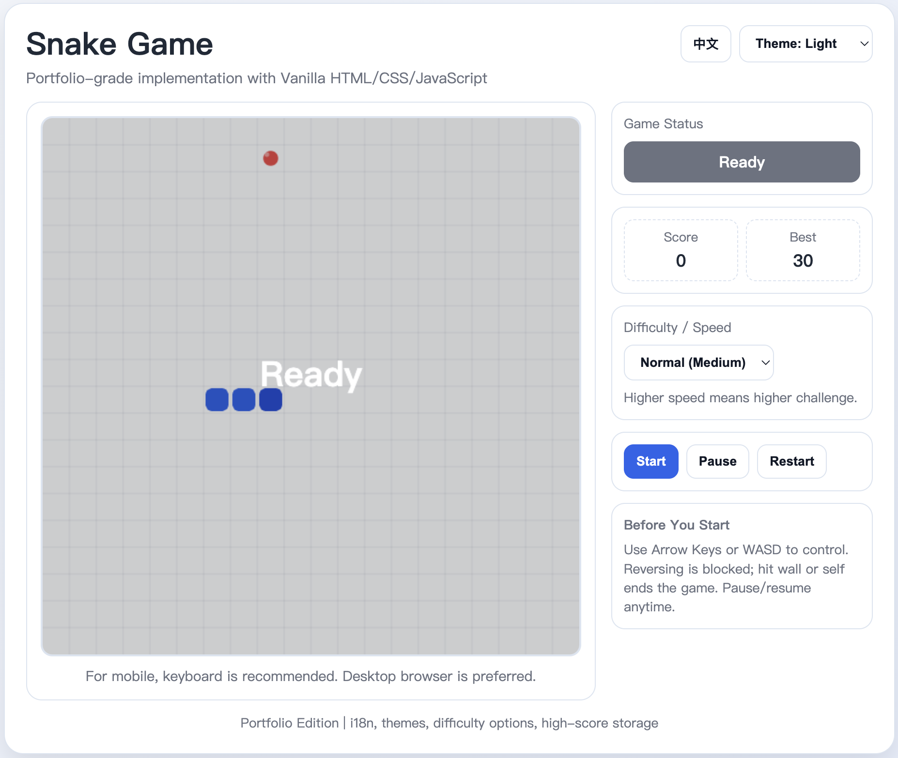

# Snake Game

A polished browser-based Snake game built with vanilla HTML, CSS, and JavaScript, suitable for GitHub portfolio presentation.

## Preview

## Live Demo

[Play the game here](https://noah-art-eng.github.io/Snake-game/)

## Project Overview

This project refines a classic Snake implementation into a cleaner frontend showcase while keeping the gameplay lightweight and easy to run locally.

## Features

- Classic Snake gameplay on a canvas grid
- Start, Pause/Resume, and Restart controls
- Real-time score and persistent high score with `localStorage`
- Difficulty selection: Easy / Normal / Hard
- Clear status system: Ready, Playing, Paused, Game Over
- Keyboard controls (`Arrow Keys` and `W/A/S/D`) with `Space` for pause/resume
- Inline game feedback messages for smoother UX transitions

## Tech Stack

- HTML5
- CSS3
- Vanilla JavaScript
- Canvas API

## How to Run

1. Open `index.html` in any modern browser.
2. Click **Start** to begin playing.

No build tools or dependencies are required.

## Controls

- Move: `Arrow Keys` or `W / A / S / D`
- Start: `Start` button
- Pause / Resume: `Pause` button or `Space`
- Restart: `Restart` button

## Project Highlights

- Single-file implementation for straightforward review and portability
- Improved visual hierarchy with a centered card-style UI
- Cleaner state handling for `ready`, `playing`, `paused`, and `over`
- Beginner/intermediate-friendly code organization and naming
